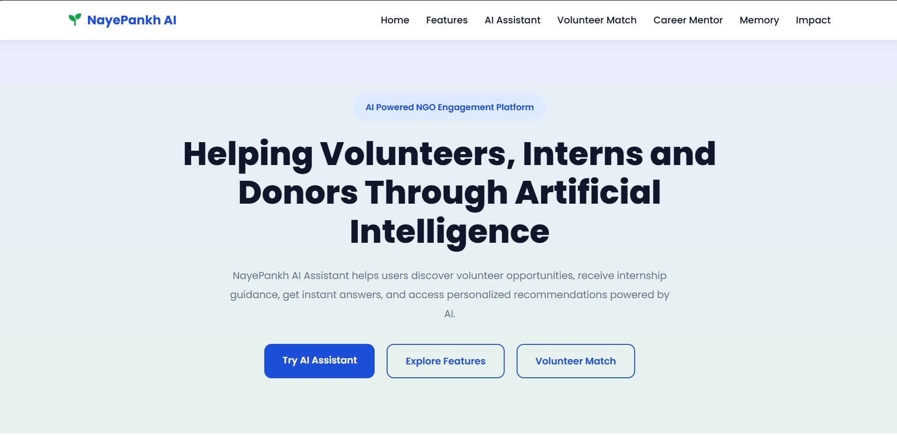
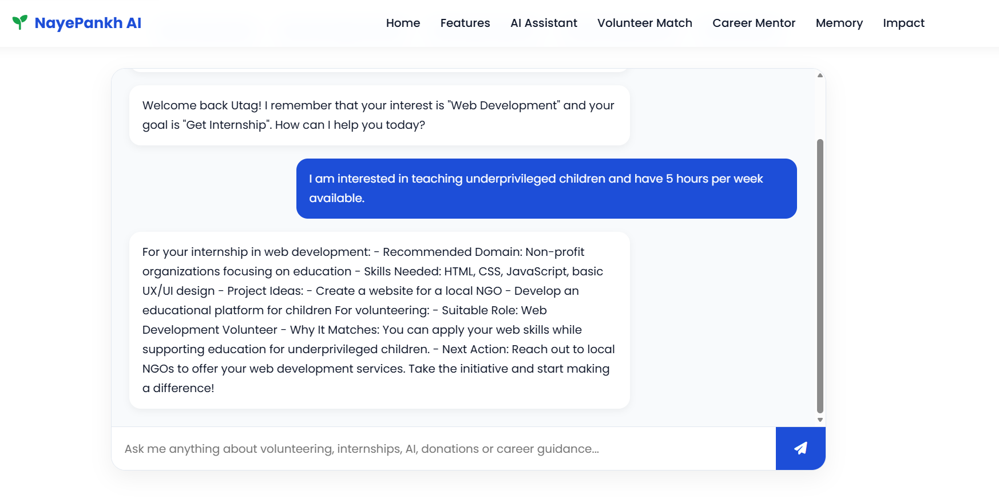
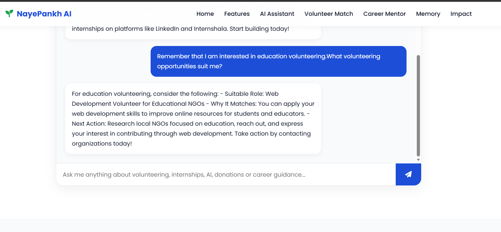
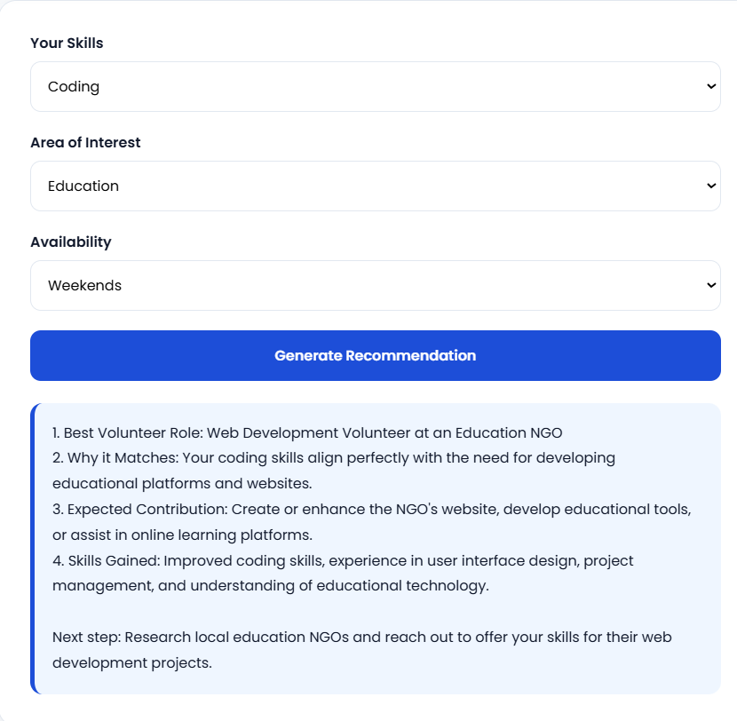
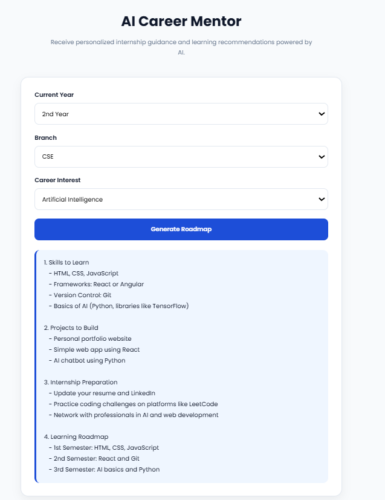

# NayePankh AI Assistant

An AI-powered platform designed to help users discover volunteering opportunities, receive career guidance, and access personalized recommendations through an intelligent assistant.

## Overview

NayePankh AI Assistant is a web-based application that combines AI-powered conversations with personalized recommendation systems to support students, volunteers, and social impact enthusiasts.

The platform provides career mentoring, volunteer matching, memory-based personalization, and multi-step guidance workflows through an intuitive and responsive user interface.

---

## Features

### AI Chatbot

* Interactive AI assistant powered by OpenRouter API
* Answers questions related to volunteering, internships, career growth, and social impact
* Provides contextual and actionable responses

### Volunteer Match Recommendation

* Matches users with suitable volunteering opportunities
* Considers skills, interests, and availability
* Generates personalized recommendations and next steps

### AI Career Mentor

* Provides customized learning roadmaps
* Suggests relevant skills and technologies
* Recommends projects and internship preparation strategies

### Memory & Personalization

* Stores user preferences
* Delivers personalized responses based on previous interactions
* Enhances user experience through contextual recommendations

### Multi-Step Guidance Workflows

* Breaks down goals into actionable steps
* Helps users plan career and volunteering journeys
* Provides structured recommendations

### Responsive UI

* Clean and modern design
* Mobile-friendly layout
* User-friendly navigation

---

## Tech Stack

### Frontend

* HTML5
* CSS3
* JavaScript

### Backend

* Node.js
* Express.js

### AI Integration

* OpenRouter API
* GPT-4o Mini

---

## Project Structure

```text
NayePankh-AI/
│
├── index.html
├── style.css
├── script.js
├── .gitignore
│
├── server/
│   ├── server.js
│   ├── package.json
│   ├── .env
│   └── .gitignore
│
├── screenshots/
│
└── README.md
```

---

## Installation

### Clone Repository

```bash
git clone <repository-url>
cd NayePankh-AI
```

### Install Backend Dependencies

```bash
cd server
npm install
```

### Configure Environment Variables

Create a `.env` file inside the server folder:

```env
OPENROUTER_API_KEY=your_api_key_here
```

### Run Backend Server

```bash
node server.js
```

Server runs on:

```text
http://localhost:3000
```

### Run Frontend

Open `index.html` using Live Server in VS Code.

---

## Screenshots

### Homepage



### AI Chatbot



### Memory Feature



### Volunteer Match



### Career Mentor



---

## Future Improvements

* User authentication
* Database integration
* Real NGO opportunity integration
* Advanced recommendation engine
* Analytics dashboard
* Voice-enabled AI assistant

---

## Author

**Utkarsh Agarwal**

B.Tech CSE (AI & ML)
ABES Engineering College, Ghaziabad

---

## License

This project was developed for internship and learning purposes.
